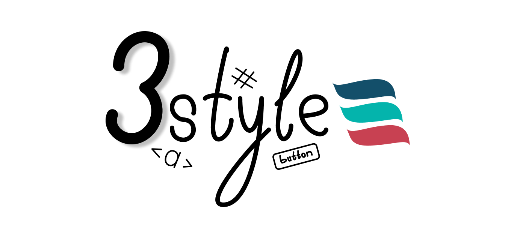

<p align="center">
    
</p>

<h3 align="center">3style</h3>

Легковесная библиотека для применения готовых стилей и компонентов команды GasuDev

## Быстрый старт
Установить модурь командой: `npm install 3style`

Предоставить доступ к файлам (примери для express)
```js
app.use('/css', express.static(path.join(_dirname, 'node_modules/3style/dist/css')));
app.use('/js', express.static(path.join(_dirname, 'node_modules/3style/dist/js')));
```

Импортировать файлы в свой проект:
``` html 
<link rel="stylesheet" href="./css/3style.min.css">
<script src="./js/3style.min.js" crossorigin="anonymous"></script>
```

``` pug 
include '../node_modules/3style/dist/pug/3style';
```

## Документация
_(Coming soon)_

## Примеры
* [demo](https://followtheowlets.github.io/3style/)
* [codepen.io](https://codepen.io/followtheowlets/pen/bGORpEp)

## License
Copyright (c) 2023 FollowTheOwlets Lev  
Licensed under the MIT license.
